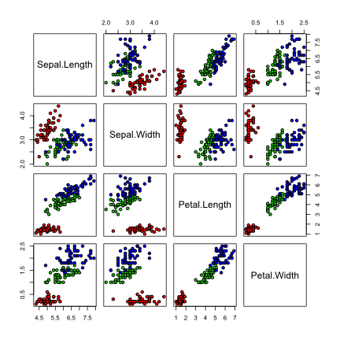
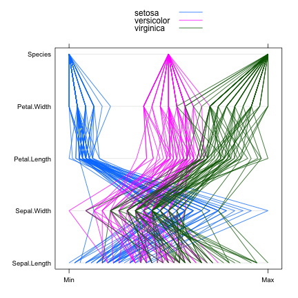
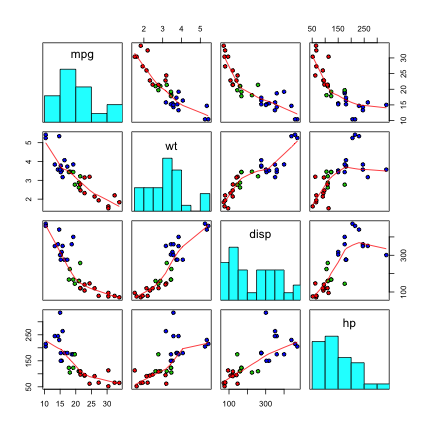

# Package mycor

This package is for automatic correlation and linear regeression test of a data.frame like `cor()` in R. 
Function `cor()` get `r` values from a numeric vector, matrix or data.frame, but it does not work in a data.frame consist of numeric, factor or character variables.  
If you wanted to get `p` values as well as `r` values, you should use `cor.test` instead of `cor`. But `cor.test` can deal with only one pair of numeric vectors of the same length, neither a matrix nor a data.frame. Furthermore, if you wanted to get the `slope` and `intercept` of simple linear regression line of xyplot, you had to perform `lm` test for every pairs of numeric variables of the data.frame.  

The main function of this package is `mycor()`. It returns an object of S3 class "mycor" consist of `r` values and `p` values as well as `slope` and `intercept` 
from lm() test. Plot "mycor" object is very simple and convenient. Plot.mycor function has four types of plots.


```r
require(mycor)
out=mycor(iris)
out
```

```

$ r value by Pearson's product-moment correlation 

             Sepal.Length Sepal.Width Petal.Length Petal.Width
Sepal.Length        1.000      -0.118        0.872       0.818
Sepal.Width        -0.118       1.000       -0.428      -0.366
Petal.Length        0.872      -0.428        1.000       0.963
Petal.Width         0.818      -0.366        0.963       1.000

$ p value ( two.sided )

             Sepal.Length Sepal.Width Petal.Length Petal.Width
Sepal.Length        0.000       0.152            0           0
Sepal.Width         0.152       0.000            0           0
Petal.Length        0.000       0.000            0           0
Petal.Width         0.000       0.000            0           0
```

```r
out1=mycor(~mpg+wt+disp+hp,data=mtcars)
plot(out,groups=Species)
```

 

```r
plot(out,type=4,groups=Spec)
```

 

```r
plot(out1,type=2,groups=cyl)
```

 

